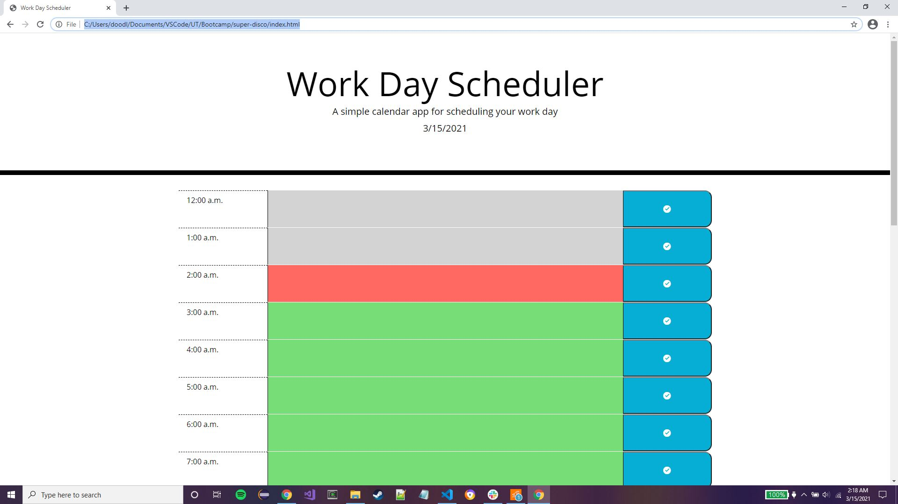

# Daily Hourly Event Scheduler

## Description

### Introduction

The purpose of this webpage was to allow the user to customize an event for every hour of the current day, and for the page to update each hour to see if it's in the past, present, or future, and color code appropiately.

### Troubles

Luckily there weren't too many roadblocks in this project. The only ones to name were simply understanding the legacy framework, moment.js and acquiring necessary documentation to perform what was needed. For the longest time it seemed very convoluted and complex to extract the hour of a day, but soon it was discovered, completely by accident, that there was a dedicated format for just that. This discovery made comparing the hours trivial.

### How It Functions

The page upon loading completely, dynamically generates all hours of the day to a div, adding the hour, activity area, and save button to the row that represents that div. Each row has a mixture of bootstrap and custom CSS to style and position it. After that it will assign the current days date to the top of the page, underneath the page description. 

When writing an activity in an hour, you must click that rows corresponding save button otherwise it will discard whatever you have written.

When you click the clear button located at the bottom of the page, it will delete all activities and reload the page to refresh the hours.

Every 5 seconds the page will check each hour and compare it to the current hour, it will then change the hours color to respresent whether it's in the past (before the current hour), in the present (within the current hour), or in the future (beyond the current hour).

Upon the day changing, it will delete all of the previous days hourly activies, refresh the hours, and change the date at the top of the page.

### Future Plans

In the future I would like to add the functionality to save all days activities in addition to being able to change days while retaining said activies.

## Deployed Project

## Screenshots

## Contributions

Classes + Base HTML Layout: Xandromous, JS + Extra CSS + Extra HTML: Brandon Shoemaker